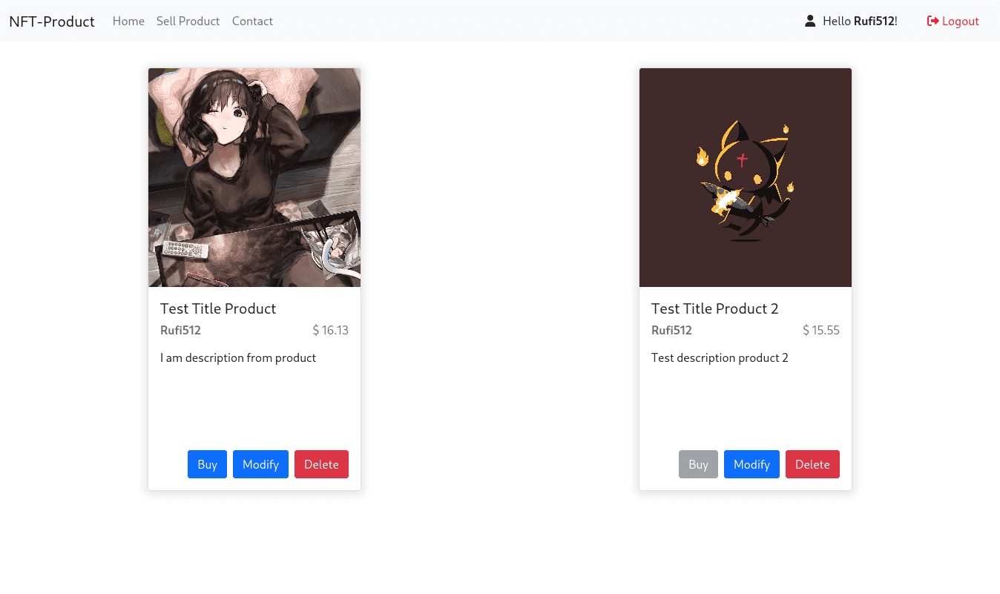

# Django-Test-App
This is a little test using django

## How to start the project

+ To start the project create an environment (preferably)

	`Python -m venv venv`
	
+ And start it
	`source venv/bin/activate`

+ Install everything in requirements.txt
	
	`pip install requirements.txt`

+ Create an .env in the root of the project that must contain:
SECRET_KEY and DEBUG_STATE

+ Do the migrations inside in the folder src
`python manage.py makemigrations`
`python manage.py migrate`

+ And start
`python manage.py runserver`